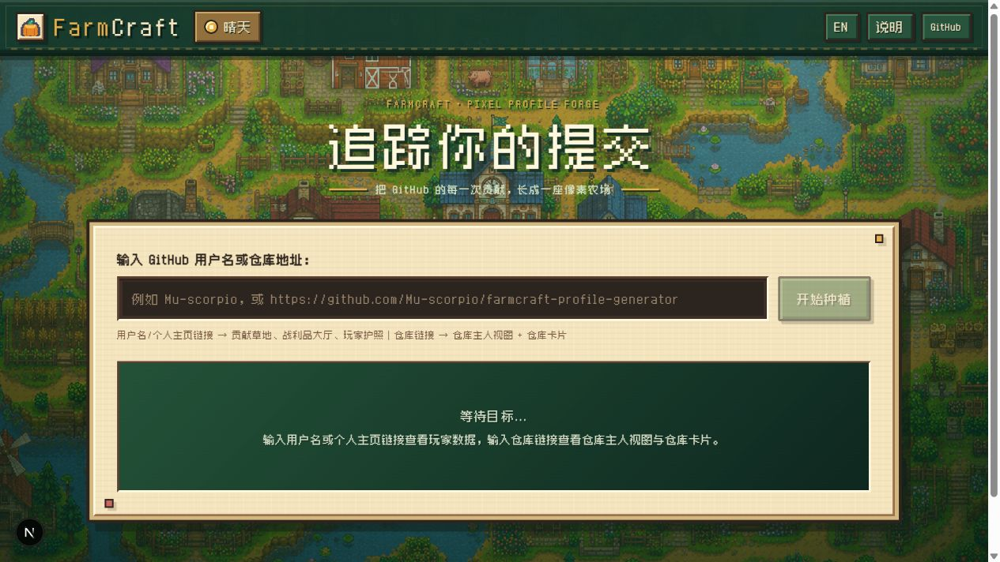

<div align="center">
  <h1>🌾 FarmCraft</h1>
  <p><strong>Plant GitHub activity into a living pixel farm.</strong></p>
  <p>Contribution Meadow · Loot Hall · Player Passport · Repo Card</p>
  <p>
    <a href="https://github.com/Mu-scorpio/farmcraft-profile-generator">Repository</a>
    ·
    <a href="LICENSE">CC BY-NC 4.0</a>
    ·
    <a href="https://github.com/Mu-scorpio/farmcraft-profile-generator/issues">Issues</a>
  </p>
</div>

<p align="center">
  
</p>

FarmCraft 2.0 turns GitHub contributions, profile statistics, and repository data into a browseable, adjustable, downloadable pixel-farm experience for GitHub Profiles, READMEs, and project pages.

## Supported input

The home page starts empty. Enter any of the following to begin:

| Input | Result |
| --- | --- |
| `Mu-scorpio` or a profile URL | Contribution Meadow, Loot Hall, and Player Passport |
| `Mu-scorpio/farmcraft-profile-generator` | Repo Card plus the first three views for owner `Mu-scorpio` |
| Any GitHub repository or sub-page URL | Automatic repository and owner-data loading |
| `@Mu-scorpio`, `owner/repo` | Automatic user/repository detection |

Repository input loads the owner’s data as well as the repository card, so all four views remain available.

## Output examples

The sections below point to FarmCraft SVG outputs saved in this repository. The examples use `Mu-scorpio` and his repository; all frames, badges, and pixel artwork are embedded, so GitHub does not need the local service to render them.

### Contribution Meadow

<p align="center">
  
</p>

### Loot Hall

Each stat has its own downloadable, embeddable SVG:

<table>
  <tr>
    <td align="center"></td>
    <td align="center"></td>
    <td align="center"></td>
    <td align="center"></td>
  </tr>
  <tr>
    <td align="center"></td>
    <td align="center"></td>
    <td align="center"></td>
    <td></td>
  </tr>
</table>

### Player Passport

<p align="center">
  
</p>

### Repo Card

<p align="center">
  
</p>

## Project map

```text
app/
├─ page.tsx                         page, parsing, and view switching
├─ components/                      view and editor components
├─ api/                             data and SVG endpoints
└─ lib/
   ├─ github.ts                     GitHub access and data shaping
   ├─ inputParser.ts                username, repo, and URL parsing
   ├─ mapSvg.ts                     Contribution Meadow SVG
   ├─ bannerSvg.ts                  Loot Hall SVG
   ├─ cardSvg.ts                    Player Passport SVG
   └─ repoSvg.ts                    Repo Card SVG and editor config
public/assets/                      farm and Repo Card artwork
docs/
├─ examples/                        SVG outputs shown in the README
└─ screenshots/                     README home-page screenshot
worker/                             Cloudflare Workers entry point
```

## Assets and license

- Project inspiration: the GitHub project by [wjz-p](https://github.com/wjz-p).
- Farm artwork: [Kenney Pixel Platformer Farm Expansion](https://kenney.nl/assets/pixel-platformer-farm-expansion), with the CC0 license kept in the repository.
- Pixel font: [Zpix](https://github.com/SolidZORO/zpix-pixel-font).
- Project license: [Creative Commons Attribution-NonCommercial 4.0 International](LICENSE).

## Development status

FarmCraft is a personal project that is still growing. Issues, visual suggestions, and new farms are welcome.

## Deployment

### Local development

```bash
git clone https://github.com/Mu-scorpio/farmcraft-profile-generator.git
cd farmcraft-profile-generator
npm install
npm run dev
```

Open <http://127.0.0.1:3001>.

### Production

```bash
npm run build
npm run start
```

### Cloudflare Workers

The optional Cloudflare path is kept in `vite.config.ts`, `wrangler.jsonc`, and `worker/`:

```bash
npm run build:vinext
npm run deploy
```
